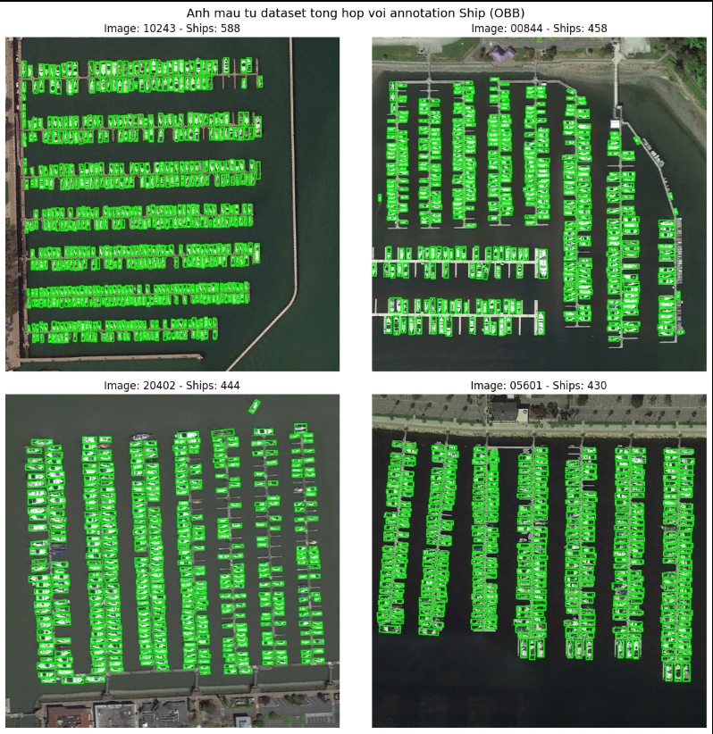

# Nhận diện Tàu từ Ảnh Vệ tinh sử dụng YOLO11m-OBB (Dataset: DIOR-R) Link dataset: [DIOR-R](https://www.kaggle.com/datasets/redzapdos123/dior-r-dataset-yolov11-obb-format)

---

## Ảnh tàu từ bộ dữ liệu DIOR-R


## Kết quả Dự đoán
* Kết quả detect tàu từ file tif lấy từ bộ dữ liệu xview2018 (2555.tif)* [File Tiff](https://www.kaggle.com/datasets/hassanmojab/xview-dataset)

* Kết qủa demo cho ảnh Tif [Ảnh Demo](./outputs/predictions/predict_tiff.png)

---

## Thống kê Phân tích Dữ liệu

### Tổng quan Dataset DIOR-R

| Thông tin | Giá trị |
|-----------|---------|
| Tổng số ảnh | **23,463** |
| Số class | **20** |
| Kích thước ảnh | 800x800 pixels |
| Độ phân giải mặt đất (GSD) | 0.5m - 30m |

### Phân bổ ảnh theo Tập dữ liệu

| Tập dữ liệu | Số ảnh | Số label |
|-------------|--------|----------|
| Train | 18,770 | 18,770 |
| Val | 2,346 | 2,346 |
| Test | 2,347 | 2,347 |
| **Tổng** | **23,463** | **23,463** |

### Thống kê Class Ship (class_id = 13)

| Tập dữ liệu | Số ảnh chứa ship | Số ảnh không chứa ship | Số object ship |
|-------------|------------------|------------------------|----------------|
| Train | 2,139 | 16,631 | 48,521 |
| Val | 279 | 2,067 | 6,726 |
| Test | 288 | 2,059 | 7,290 |
| **Tổng** | **2,706** | **20,757** | **62,537** |

> **Nhận xét**: Chỉ khoảng 11.5% tổng số ảnh chứa tàu, nhưng mỗi ảnh chứa tàu có trung bình ~23 object tàu.

### Danh sách 20 Class trong Dataset

```
0: airplane        5: chimney              10: groundtrackfield   15: storagetank
1: airport         6: dam                  11: harbor             16: tenniscourt
2: baseballfield   7: Expressway-Service   12: overpass           17: trainstation
3: basketballcourt 8: Expressway-toll      13: ship  <-- TARGET   18: vehicle
4: bridge          9: golffield            14: stadium            19: windmill
```

---

## Hướng dẫn Sử dụng

### 1. Cài đặt

```bash
# Clone repository
git clone https://github.com/Samoyed-911/task-2.git
cd task-2

# Cài đặt dependencies
pip install -r requirements.txt
```

### 2. Chạy Notebook

Mở và chạy file `task-2.ipynb` để:
- Phân tích dữ liệu
- Tạo ship-only dataset
- Huấn luyện mô hình
- Dự đoán trên ảnh vệ tinh

---

## Giải thích File ships.geojson

File `outputs/predictions/ships.geojson` chứa kết quả dự đoán tọa độ các tàu được phát hiện.

### Cấu trúc File

```json
{
  "type": "FeatureCollection",
  "crs": {
    "type": "name",
    "properties": {"name": "EPSG:4326"}
  },
  "features": [
    {
      "type": "Feature",
      "id": "ship_0001",
      "geometry": {
        "type": "Polygon",
        "coordinates": [[[lon1,lat1], [lon2,lat2], [lon3,lat3], [lon4,lat4], [lon1,lat1]]]
      },
      "properties": {
        "confidence": 0.8817
      }
    }
  ]
}
```

### Giải thích các Trường

| Trường | Mô tả |
|--------|-------|
| `type: FeatureCollection` | Định dạng chuẩn GeoJSON chứa nhiều features |
| `crs` | Hệ tọa độ tham chiếu: EPSG:4326 (WGS84 - tọa độ GPS) |
| `features` | Mảng chứa các tàu được phát hiện |
| `id` | Mã định danh duy nhất của tàu (ship_XXXX) |
| `geometry.type` | Polygon - hình đa giác 4 đỉnh (Oriented Bounding Box) |
| `geometry.coordinates` | Mảng tọa độ 4 góc OBB theo [longitude, latitude] |
| `properties.confidence` | Điểm tin cậy của dự đoán (0-1, càng cao càng chính xác) |

### Đặc điểm

- **Số tàu phát hiện**: 91 tàu trong ảnh test
- **Hệ tọa độ**: EPSG:4326 (WGS84) - tương thích với Google Maps, QGIS
- **Định dạng OBB**: Polygon 4 đỉnh, có thể xoay theo hướng tàu
- **Confidence**: Lọc các kết quả có confidence >= 0.25

---

## Mô tả Bài toán

- Mô hình: YOLO11m-OBB (Oriented Bounding Box) train qua GPU T4 của google colab 
- Framework: PyTorch + Ultralytics
- Dataset huấn luyện: DIOR-R
- Dữ liệu suy luận: Ảnh lấy từ bộ dữ liệu xview 2018

### So sánh DIOR-R với PlanetScope 3m

| Đặc điểm | DIOR-R | PlanetScope |
|----------|--------|-------------|
| GSD | 0.5m - 30m | 3m (cố định) |
| Kích thước ảnh | 800x800 | Thay đổi (có thể rất lớn) |
| Định dạng | JPG | GeoTIFF |
| Geo-reference | Không | Có (CRS, transform) |

DIOR-R có độ phân giải tương đương hoặc tốt hơn PlanetScope nên phù hợp để huấn luyện mô hình áp dụng cho ảnh PlanetScope.

---

## Huấn luyện

### Mô hình

- **YOLO11n-OBB** (yolo11n-obb.pt): Mô hình được huấn luyện trên GPU của máy tính cá nhân
- - **YOLO11m-OBB** (`yolo11m-obb.pt`): Mô hình được huấn luyện trên GPU T4 của Google Colab và hiện đang được sử dụng để kiểm thử.  
  👉 [Xem Notebook](https://colab.research.google.com/drive/1fRqhC7hAi87HGzpbKi64ChUWmXt6aR73?usp=sharing)

### Tham số huấn luyện

| Tham số | Giá trị | Mô tả |
|---------|---------|-------|
| epochs | 100 | Số vòng lặp toàn bộ dataset |
| batch | 16 | Kích thước batch |
| imgsz | 640 | Kích thước ảnh đầu vào |
| optimizer | AdamW | Optimizer |
| lr0 | 0.001 | Learning rate ban đầu |
| lrf | 0.01 | Hệ số LR cuối (final_lr = lr0 * lrf) |
| warmup_epochs | 3 | Số epoch khởi động |
| patience | 30 | Early stopping |
| degrees | 180 | Xoay ngẫu nhiên (quan trọng cho tàu hướng nhiều góc) |
| mosaic | 1.0 | Mosaic augmentation |
| amp | True | Mixed Precision Training |

---

## Đánh giá trên tập validation (YOLO11n-obb)
- Precision: 0.9274
- Recall: 0.9480
- mAP@50: 0.9755
- mAP@50-95: 0.8000

## Đánh giá trên tập test (YOLO11n-obb)
- Precision: 0.9459
- Recall: 0.9421
- mAP@50: 0.9731
- mAP@50-95: 0.8036

---

## Quy trình Xử lý ảnh GeoTIFF

1. Đọc ảnh GeoTIFF với thông tin geo-reference
2. Chia ảnh thành các tile (sliding window)
3. Dự đoán trên từng tile
4. Chuyển đổi OBB từ pixel sang tọa độ địa lý
5. Gộp kết quả và áp dụng NMS loại bỏ trùng lặp
6. Xuất GeoJSON với CRS EPSG:4326